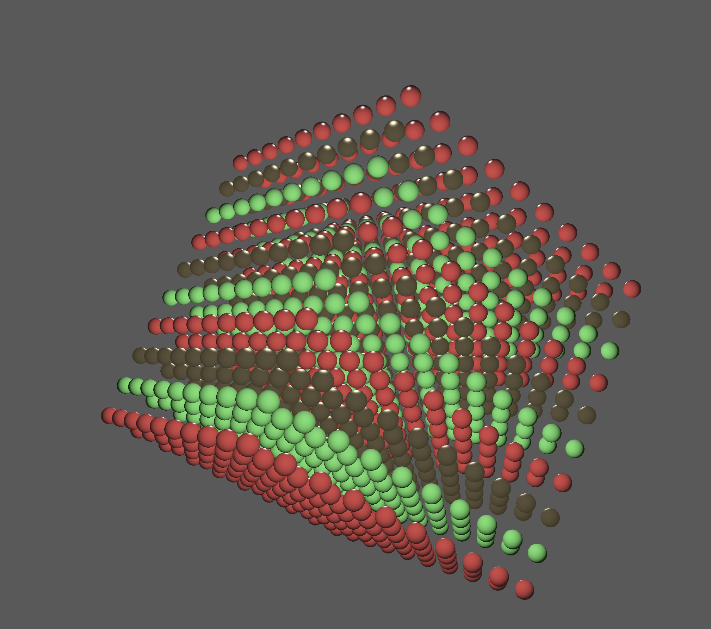

# Metal Render Pipeline
AJ Matheson-Lieber

## Dependencies

These samples include the **metal-cpp** and **metal-cpp-extensions** libraries.

Use either the included Xcode project or the UNIX make utility to build the project.

This project requires C++17 support (available since Xcode 9.3).

## Building with Make

To build the samples using a Makefile, open the terminal and run the `make` command. The build process will put the executables into the `build/` folder.

By default, the Makefile compiles the source with the `-O2` optimization level. Pass the following options to make change the build configuration:

* `DEBUG=1` : disable optimizations and include symbols (`-g`).
* `ASAN=1` : build with address sanitizer support (`-fsanitize=address`).

## Overview

This project implements a simple real-time rendering pipeline in **Metal** using **C++**. After spending much of the semester working in BabylonJS, I wanted to explore a lower-level graphics API and revisit C++ development. Starting from a minimal template that initialized a window and provided basic geometry rendering, I extended the system significantly.

The final pipeline includes:

- **Point-based Blinn–Phong lighting**
- **Procedural sphere generation**
- **Simple FPS-style camera movement**
- **Three custom material presets** (matte, plastic, metallic)

This project provided hands-on experience with GPU programming, shader development, and the structure of a graphics pipeline outside of a high-level engine.

---

## Challenges

Transitioning from BabylonJS to Metal was the most substantial obstacle. BabylonJS abstracts nearly all rendering details—geometry buffers, camera management, light calculations—while Metal requires manual control over:

- Buffer creation and memory layout  
- Uniform and argument encoding  
- Shader program structure  
- Render pipeline configuration  

To navigate this, I broke the pipeline into explicit stages and mapped familiar concepts (meshes, materials, transforms) onto Metal’s API. This required deepening my understanding of Metal’s buffer model and shader system.

### Lighting Implementation

The template only supported directional diffuse lighting. Implementing point-based Blinn–Phong lighting involved:

- Restructuring uniform buffers  
- Adding a light position and intensity  
- Rewriting the fragment shader  
- Debugging issues related to coordinate spaces and normal correctness  

### Geometry Generation

Metal does not provide built-in primitive shapes. Procedurally generating spheres required:

- Computing latitude/longitude vertices  
- Generating smooth normals  
- Building indexed triangle lists  
- Testing lighting across material presets to confirm correctness  

### Unresolved or Partially Completed Challenges

Some features did not make it into the final version due to time constraints:

- **Skybox or textured background:** Implementing this required additional shader work and texture resources, so the pipeline uses a simple clear color.
- **Physically Based Rendering (PBR):** Full PBR requires environment maps and additional material parameters. I compromised with three Blinn–Phong–based presets.
- **Engine-level abstractions:** A more modular engine architecture (meshes, materials, scene graph) would improve extensibility, but was out of scope.
- **Polished camera controls:** The camera works but lacks smoothing, mouse locking, or more expressive input handling.

These compromises allowed me to focus on delivering stable, core rendering features within the project timeline.

---

## Discussion

Overall, this project gave me a much deeper understanding of how a rendering pipeline operates beneath the abstractions of a high-level engine. By implementing point lighting, procedural geometry, custom materials, and a manual camera system, I built a small but complete real-time rendering environment where I controlled everything from CPU-side data structures to GPU-side shading calculations.

With more time, I would have pursued improvements in two main areas:

### 1. Visual Fidelity
- Skybox and image-based reflections  
- More advanced material models  
- Higher-quality shading and post-processing  

### 2. Architectural Structure
- Modular engine-like components (mesh loader, material system, renderer interface)  
- Additional geometry generators  
- UI-based material switching  
- Improved camera and input system  

Despite some features not making it into the final build, the project succeeded in teaching me how low-level rendering works in practice and highlighted clear pathways for turning this prototype into a more polished mini-engine.

---

## Sources

- https://developer.apple.com/metal/sample-code/  
- https://developer.apple.com/documentation/Metal/
