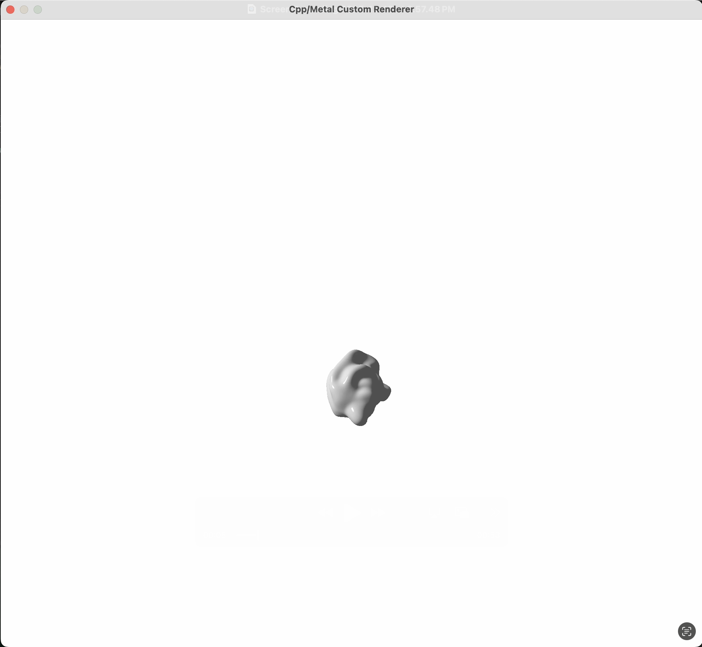

# Metal Render Pipeline
AJ Matheson-Lieber

Figure shows a screenshot of a figure I sculpted in blender and imported to my renderer as an object file.

## Dependencies

These samples include the **metal-cpp** and **metal-cpp-extensions** libraries.

Use either the included Xcode project or the UNIX make utility to build the project.

This project requires C++17 support (available since Xcode 9.3).

## Building with Make

To build the samples using a Makefile, open the terminal and run the `make` command. The build process will put the executables into the `build/` folder.

By default, the Makefile compiles the source with the `-O2` optimization level. Pass the following options to make change the build configuration:

* `DEBUG=1` : disable optimizations and include symbols (`-g`).
* `ASAN=1` : build with address sanitizer support (`-fsanitize=address`).

## Overview

This project implements a real-time rendering pipeline in **Metal** using **C++**. I was motivated to create this project after taking a class on 3d computer graphics. This project is an exploratory implementation of a lower-level graphics API using C++ and Metal.

The final pipeline includes:

- **Point-based Blinn–Phong lighting**
- **Procedural sphere generation**
- **Three custom material presets**
- **Object and Material file loading**

This project provided hands-on experience with GPU programming, shader development, and the structure of a graphics pipeline outside of a high-level engine.

---

## Challenges

Transitioning from BabylonJS to Metal was the most substantial obstacle. BabylonJS abstracts nearly all rendering details—geometry buffers, camera management, light calculations—while Metal requires manual control over:

- Buffer creation and memory layout  
- Uniform and argument encoding  
- Shader program structure  
- Render pipeline configuration  

To navigate this, I broke the pipeline into explicit stages and mapped familiar concepts (meshes, materials, transforms) onto Metal’s API. This required deepening my understanding of Metal’s buffer model and shader system.

### Lighting Implementation

The template only supported directional diffuse lighting. Implementing point-based Blinn–Phong lighting involved:

- Restructuring uniform buffers  
- Adding a light position and intensity  
- Rewriting the fragment shader  
- Debugging issues related to coordinate spaces and normal correctness  

### Object File Loading

I added a custom Object (.obj) and Material (.mtl) file parser based on the Wavefront Object file format. The system supports specular color, diffuse color, emmissive color, and shininess based on the lighting implementation I currently have (so no reflection or textures yet). File parsing requires:

- Text based file parsing
- Input validation and security
- Memory allocation and management

### Geometry Generation Fallback

Metal does not provide built-in primitive shapes, so I decided to implement procedural sphere generation as a fallback. Procedurally generating spheres required:

- Computing latitude/longitude vertices  
- Generating smooth normals  
- Building indexed triangle lists  
- Testing lighting across material presets to confirm correctness  

---

## Sources

- https://developer.apple.com/metal/sample-code/  
- https://developer.apple.com/documentation/Metal/
